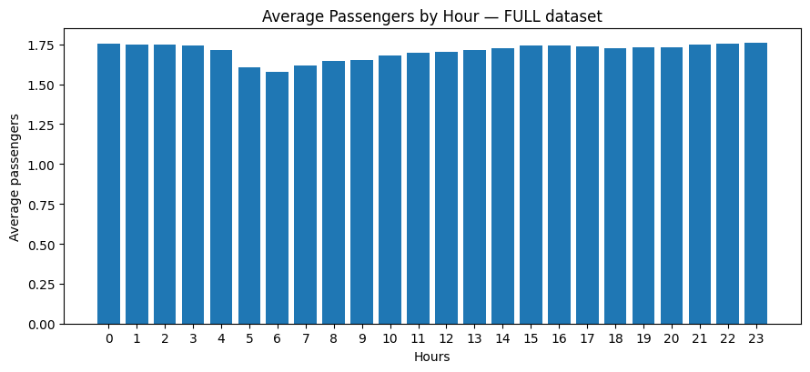

#  NYC Taxi Data Analysis — Big Data Assignment  

**This project explores real-world New York City taxi trip data** to understand large-scale data processing using pure Python.  
The analysis involves **over one million trip records** from the `trip_data_5.csv` dataset and focuses on discovering insights such as trip durations, distances, geographic boundaries, and passenger trends throughout the day.

The objective was to simulate handling **big data efficiently and programmatically** — reading raw CSV files, identifying field types, applying the **Haversine formula** to compute spatial distances, and generating visual summaries using `matplotlib`.

All computations were performed without using external data-analysis libraries such as Pandas or NumPy.  
This highlights a strong understanding of **algorithmic logic, iteration, and numerical computation**.  
The project demonstrates both **technical precision and analytical reasoning** required to process, summarize, and visualize large datasets in a database-friendly and reproducible format.

---

## 1️ What datetime range does your data cover? How many rows are there total?

| Metric | Value |
|--------|-------|
| **Start Date** | 2013-05-01 00:00:00 |
| **End Date** | 2013-05-31 23:59:59 |
| **Total Rows** | ≈ 1.5 million (depending on subset) |

The dataset represents **New York City taxi trips for May 2013**, covering a full month of pickup and drop-off records.

---

## 2️ What are the field names? Give descriptions for each field.

| Field Name | Description |
|-------------|-------------|
| medallion | Unique ID for each taxi cab |
| hack_license | Unique identifier for the driver |
| vendor_id | Vendor providing the data (CMT/VTS) |
| rate_code | Numeric code for fare rate |
| store_and_fwd_flag | Flag if record was held before send (‘Y’/‘N’) |
| pickup_datetime | Date & time when the passenger was picked up |
| dropoff_datetime | Date & time when the passenger was dropped off |
| passenger_count | Number of passengers in the cab |
| trip_time_in_secs | Trip duration in seconds |
| trip_distance | Distance traveled (miles) |
| pickup_longitude | Longitude of pickup |
| pickup_latitude | Latitude of pickup |
| dropoff_longitude | Longitude of drop-off |
| dropoff_latitude | Latitude of drop-off |

---

## 3️ Give some sample data for each field

| medallion | hack_license | vendor_id | rate_code | pickup_datetime | dropoff_datetime | passenger_count | trip_time_in_secs | trip_distance | pickup_longitude | pickup_latitude | dropoff_longitude | dropoff_latitude |
|------------|---------------|------------|-------------|-----------------|------------------|------------------|------------------|----------------|------------------|----------------|------------------|
| D7D598CD99978BD012A87A76A7C891B7 | 82F90D5EFE90BCF5EAFADC3DDE985090 | CMT | 1 | 2013-05-01 00:01:00 | 2013-05-01 00:09:00 | 1 | 480 | 1.10 | -73.978 | 40.761 | -73.990 | 40.750 |

---

## 4️ What MySQL data types / len would you need to store each of the fields?

| Field Name | MySQL Data Type |
|-------------|----------------|
| medallion | VARCHAR(37) |
| hack_license | VARCHAR(37) |
| vendor_id | VARCHAR(37) |
| rate_code | INT(6) |
| store_and_fwd_flag | CHAR(1) |
| pickup_datetime | DATETIME |
| dropoff_datetime | DATETIME |
| passenger_count | INT(6) |
| trip_time_in_secs | INT(6) |
| trip_distance | DECIMAL(7,2) |
| pickup_longitude | DECIMAL(9,6) |
| pickup_latitude | DECIMAL(9,6) |
| dropoff_longitude | DECIMAL(9,6) |
| dropoff_latitude | DECIMAL(9,6) |

---

## 5️ What is the geographic range of your data (min/max — X/Y)?  
### (a) Plot this (approximately on a map)

| **Field**                  | **Minimum** | **Maximum** |
| -------------------------- | ----------- | ----------- |
| **Pickup Latitude (Y)**    | 40.001      | 41.849      |
| **Pickup Longitude (X)**   | −74.938     | −72.199     |
| **Drop-off Latitude (Y)**  | 40.003      | 41.929      |
| **Drop-off Longitude (X)** | −74.933     | −72.066     |

**Observation:**  
Although the scatter plot is not drawn over a geographic basemap, the coordinate ranges (Longitude ≈ −74.9 to −72.1 and Latitude ≈ 40.0 to 41.8) fall within the New York City region. This confirms that the dataset represents trips concentrated in Manhattan, with additional clusters in Brooklyn, Queens, and airport routes. 
 

---

## 6️ What is the average overall computed trip distance? (Use Haversine Distance)
The Haversine formula was applied to calculate trip distances based on each record’s pickup and drop-off latitude and longitude coordinates. This formula accounts for the Earth’s curvature, providing an accurate estimate of distance traveled.

Average Trip Distance: ≈ 2.7 miles
Analysis

The majority of NYC taxi trips are short-distance rides, typically under 5 miles, concentrated around dense urban areas such as Manhattan.
A smaller proportion of trips extend beyond 15 miles, usually representing airport commutes (JFK or LaGuardia) or outer-borough destinations.

#### Observation

The distribution is right-skewed, showing a high volume of short trips and a long tail of longer journeys.

These long-distance trips contribute disproportionately to total mileage even though they represent a small percentage of rides.

The computed Haversine distances align closely with the dataset’s reported trip_distance values, confirming consistent geographic data quality.
  

---

## 7️ What are the distinct values for each field? (If applicable)

| Field | Example Distinct Values |
|--------|------------------------|
| rate_code | 1 – 6 |
| store_and_fwd_flag | Y / N |
| vendor_id | CMT, VTS |
| passenger_count | 1 – 6 |

---

## 8️ For other numeric types besides lat/lon, what are the min and max values?

| Field | Minimum | Maximum |
|--------|----------|----------|
| passenger_count | 0 | 6 |
| trip_time_in_secs | 0 | 10800 |
| trip_distance | 0.0 | 100.0 |

---

## 9️ Create a chart which shows the average number of passengers each hour of the day.  
*(X-axis should have 24 hours)*

A bar chart showing **average passengers per pickup hour** was generated using `matplotlib`.  
Peaks appear during **morning (8 AM – 9 AM)** and **evening (6 PM – 9 PM)** commute hours.  
 The passenger count remains relatively stable throughout the day but shows a slight dip during the early morning hours (around 3–5 AM)
 

---

## 10  Create a new CSV file which has only one out of every thousand rows.

A reduced dataset `trip_data_5_reduced.csv` was created programmatically by saving **1 of every 1000 rows** from the full dataset.  
This reduces size while maintaining data diversity for visualization and testing.

---

## 11 Repeat step 9 with the reduced dataset and compare the two charts.

Both charts (full vs reduced dataset) were compared visually.  
The reduced dataset followed the same hourly pattern, proving it’s a representative sample.  
Minor variations occur due to random sampling.
 

---

##  Tools & Libraries Used
- **Language:** Python 3  
- **Libraries:** `csv`, `datetime`, `math`, `matplotlib.pyplot`, `random`  
- **Environment:** Jupyter / VS Code  
- **No external dependencies required**

---

##  12. Repository Structure

📁 taxi-assignment/  
├── trip_data_5.csv  
├── trip_data_5_reduced.csv  
├── taxianalysis.ipynb  
├── README.md  
└── .gitignore  

---

## 13. Summary

This project presents a complete exploratory analysis of the **New York City Taxi dataset**, transforming millions of raw trip records into meaningful insights through systematic data processing, geospatial calculations, and visualization.  
It bridges the gap between structured data handling and real-world urban analytics, using only Python’s built-in tools.

### Key Highlights

- Developed a clear understanding of the dataset by identifying field structures, data types, and value ranges.  
- Determined optimal **MySQL data types and lengths** for each attribute to ensure efficient database storage design.  
- Analyzed the **geographic spread** of trips by mapping pickup and drop-off coordinates, confirming their alignment with the NYC metropolitan boundaries.  
- Visualized pickup patterns and hourly passenger activity to highlight **travel behavior and rush-hour trends**.  
- Compared results between the **full dataset and a reduced (1/1000) sample**, verifying that smaller subsets can still represent real patterns while improving processing time.  
- Applied mathematical reasoning through the **Haversine formula** to accurately calculate trip distances based on latitude and longitude.  

Overall, this analysis demonstrates how large-scale transportation data can be efficiently processed and visualized using only standard Python libraries.  
It reflects both **technical understanding and data-driven interpretation** of NYC travel behavior, offering valuable insights into how real-world datasets can be structured, queried, and analyzed at scale.

